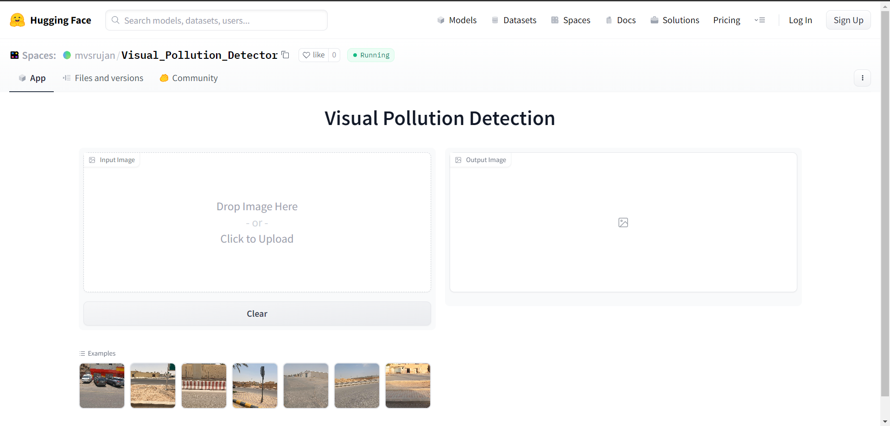

# YVPD - YOLO Visual Pollution Detector

YVPD is a YOLO based Visual Pollution Detector trained on the images provided as a part of SDAIA Smartathon 2023. The model takes as input images or frames from videos
and outputs the Bounding Boxes and Class of Visual Pollution depicted in the boxes. 

## Deployed Product & Instructions

### Step 1
Visit the Hugging Face [Link](https://huggingface.co/spaces/mvsrujan/Visual_Pollution_Detector)  

You should see the following screen: 

  

### Step 2
To run an instance, either simply choose to run an instance from uploaded example.  
You may also choose to upload an image using the gradio interface!  

  

You should see a green "running" status on top navigation bar.

### Step 3
The interface runs the image through our pre-trained model and displays the bounding boxes to its best estimate in a matter of seconds!  

Note that it may take a few seconds on your first run as the model clones the repo!  

 

Alternatively, you can use this [link](https://colab.research.google.com/drive/1OUn1sCrtpWt2XoIYHIcsJxP_qO_IY9KR?usp=sharing#scrollTo=GBaO4FfHorNL) for testing the model on the example images. On opening the link, Click on Runtime-->Run all to run the notebook. To test different images, uncomment the lines of code as instructed.

## Dashboard

The [Dashboard](https://public.tableau.com/app/profile/khusheekapoor/viz/Smartathon/Dashboard1) gives us integral insights on the prevelance of the various types of pollution and the associativity of the different types of pollution with each other.

### Plots & Graphs

- Prevelance of Pollution Types
- Location-wise Prevelance of Pollution (process of allocation of location is depicted in [this](/notebooks/smartathon-eda.ipynb) notebook).
- Location-wise Prevalance of Pollution Types
- Location-wise Associativity of Garbage with Other Types

## Proposed Workflow

## Navigation

- [Notebooks](/notebooks): Contains the source code of all the models trained and tested.
- [Weights](/weights): Contains the weights of the model for future use.
- [imgs](/imgs): Contains all the images used in the README.

## More Information at: [Project Report](https://docs.google.com/document/d/1lu1S894pztMraHJdqC3tFcTxCiQKqoT9m875k6xM6TM/edit?usp=sharing)
